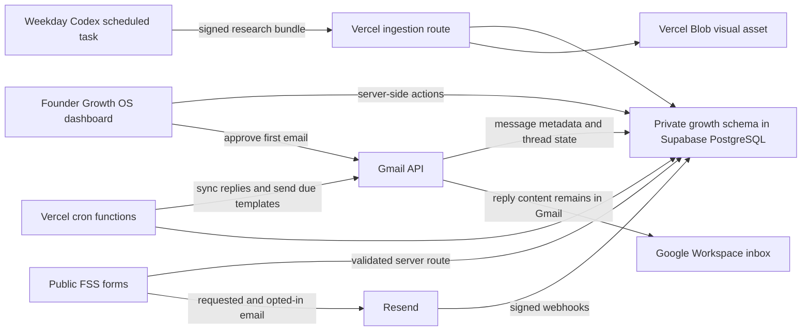

# FSS Growth OS Design Specification

Title: FSS Growth OS
Owner: Strategic and Technical Agents
Status: Approved for implementation planning
Created: 16 August 2026
Last Updated: 16 August 2026
Related Docs: `docs/growth-os/README.md`, `docs/growth-os/data-api-security.md`, `docs/growth-os/email-content-and-image-standard.md`

## Problem Statement

FSS needs a private operating system that turns researched Kent businesses into reviewed outreach, consistent follow-up, qualified opportunities, and delivery work without scattering state across Notion, inboxes, and spreadsheets.

The system must automate repetitive research and sequence work while keeping the founder in control of the first message, every direct reply, and every production release.

## Goals

- Find ten qualified Kent-based local service companies on each weekday research run.
- Give the founder a clear evidence-backed queue for approving first emails.
- Send cold outreach from Google Workspace and keep the whole conversation in Gmail.
- Stop automated follow-ups immediately when a human response or stop condition appears.
- Manage prospects, pipeline, deals, clients, delivery, site leads, and newsletter subscribers in PostgreSQL.
- Send complete, branded, accessible site and newsletter emails through Resend.
- Send a reviewed client thank-you after completed delivery with a separate optional FSS Field Notes opt-in.
- Produce website strategy, FSS service recommendations, and 3D hero concepts as research deliverables.
- Keep all runtime access server-side and auditable.
- Move the application to Vercel through a controlled preview-first migration.

## Non-Goals

- No OpenAI, GPT, or image-generation API is called by the MVP application.
- No autonomous direct response is sent after a prospect replies.
- No cold outreach is sent through Resend.
- No Supabase Auth, Supabase browser client, Realtime, Edge Functions, or Storage is required for the MVP.
- No Notion runtime dependency exists.
- No historical HubSpot import is performed without a separate reviewed export and migration plan.
- No invoicing, payment processing, or accounting-platform sync is included in the MVP.
- No sole trader or uncertain partnership receives unsolicited electronic marketing.
- No Google Maps review bodies, photos, ratings, or other restricted Maps content are copied into PostgreSQL.
- No production domain cutover is included in an ordinary code merge.

## User And Business Impact

The only dashboard user is the founder. The system reduces context switching and makes daily decisions explicit:

- What needs approval now?
- Why is this prospect a good fit?
- What evidence supports the proposed message?
- What will send next, and what can stop it?
- Which opportunities are moving toward revenue?
- Which opted-in subscribers should receive site and newsletter emails?

The business target is a reliable founder-led acquisition workflow that can be measured before FSS invests in paid AI APIs.

## Architecture

### Application

- Keep the existing Next.js 16 App Router project.
- Add the private dashboard under `/growth` using Server Components by default.
- Keep route handlers thin. Validation lives at the boundary; business rules live in domain services.
- Use the Node.js runtime for database, OAuth, Gmail, Resend, and Blob work.
- Use `proxy.ts` for the first route gate, then repeat authorization in every protected server action and route handler.

### Hosting

- Vercel Pro hosts the eventual production Next.js application, route handlers, cron routes, and generated visual blobs.
- Netlify stays live while Vercel preview deployments are validated.
- Vercel production cron routes remain inert while `GROWTH_OS_AUTOMATIONS_ENABLED=false`.
- The final domain promotion and Netlify retirement are separate, explicit actions.

### Database

- Supabase project reference: `gfeyanrriryihpcgdvqi`.
- Supabase supplies PostgreSQL only.
- All product tables live in a private `growth` schema.
- Runtime functions use the shared transaction pooler connection and disable prepared statements when required by the selected driver.
- Migrations and administrative commands use the direct or session connection recommended by Supabase.
- The application does not ship a Supabase key or database credential to the browser.

### Founder Authentication

Use two separate Google OAuth clients:

1. Dashboard sign-in requests only OpenID, email, and profile. The sign-in callback accepts exactly the configured founder email and rejects every other account.
2. Gmail automation requests offline access and the smallest Gmail scope that supports draft/send plus reply metadata. Its refresh token is encrypted at rest and never placed in a browser-visible variable.

The allowlist is enforced in the authentication callback, server-side page loader, server actions, route handlers, and audit records.

## Research Workflow

The scheduled Codex task runs at 06:00 Europe/London on weekdays and targets ten accepted prospects.

### Target Mix

- Home and property services
- Garages and vehicle services
- Accountants
- Estate agents
- Restaurants
- Other Kent-based local service companies that match the same commercial pattern

### Research Sources

- Google Search and Google Maps for discovery only
- First-party business websites
- Companies House for legal entity verification
- Other clearly attributed public first-party sources when needed

Google Maps is not treated as a database. Store only a Google place ID and reference URL where available. Do not persist Maps reviews, photos, rating values, or copied listing text. Claims used in outreach must be supported by a permitted first-party or Companies House source.

### Acceptance Rules

- Kent location verified
- Corporate subscriber status verified as a limited company, LLP, Scottish partnership, or another clearly eligible corporate body
- Active business verified
- Suitable service opportunity identified
- Work email source recorded
- Suppression list checked
- Evidence bundle contains source URLs and observation times
- First-email copy is factual and brand-compliant
- Visual is conceptual and clearly labelled, with a fallback approved sector visual available

Sole traders, personal email addresses, uncertain partnerships, duplicates, suppressed contacts, and unverifiable claims are rejected or moved to manual review.

## Email System

### Cold Outreach Through Gmail

- The first email is personalised and fully rendered for founder approval.
- Target length is 140 to 220 words.
- It contains one lightweight conceptual visual, useful alt text, and a plain-text alternative.
- It contains no tracking pixel and no hidden open tracking.
- It identifies FSS, explains why the prospect is receiving the message, and offers a direct opt-out.
- The visual cannot impersonate an existing site or claim that results already exist.
- Days 5, 11, and 20 use approved text-first templates in the same Gmail thread.
- Direct replies are handled manually in Gmail.

### Requested And Opted-In Email Through Resend

- Site enquiry acknowledgements, resource delivery, newsletter welcome, and newsletter issues use complete React Email templates.
- Templates include generated FSS editorial visuals, responsive copy, meaningful alt text, and plain-text versions.
- Every message sets `Reply-To: j.ntagengwa@faithfulsoftware.dev`.
- Newsletter sends require recorded opt-in and an unsubscribe link.
- Transactional acknowledgements do not imply newsletter consent.
- Resend webhooks update delivery, bounce, complaint, and suppression state.

### Generated Visuals

- The scheduled Codex task may upload one prospect-specific visual with the research bundle.
- If the scheduled environment cannot create or upload an image, the system chooses a founder-approved sector visual rather than calling a paid image API.
- Prospect visuals are stored in a public Vercel Blob store under opaque, unguessable names because email clients need a stable public URL.
- PostgreSQL stores asset metadata, ownership, checksum, prompt summary, alt text, size, dimensions, and review state.
- A visual over 180 KB, with missing alt text, containing unsupported claims, or failing the aspect-ratio check cannot enter `ready_for_review`.

## Primary User Flows

### Morning Review

1. Founder signs in with the permitted Workspace account.
2. Overview shows first emails, replies, follow-ups, pipeline, and upcoming actions.
3. Founder opens a prospect, reviews evidence, recommended offer, full email copy, and the generated visual.
4. Founder edits, marks for redraft, creates a Gmail draft, rejects, or approves and sends.
5. Approval records an immutable message snapshot and starts the sequence.

### Follow-Up And Reply Stop

1. A cron job synchronises Gmail message metadata before dispatching due messages.
2. Any reply, bounce, opt-out, rejection, started-talks state, or manual pause stops the sequence.
3. A due message is claimed with a lease and suppression is checked again.
4. The service sends the approved template snapshot into the original Gmail thread.
5. Provider identifiers, timestamps, and audit events are saved.

### Site Lead And Opt-In

1. The public route validates the form and records the inbound lead in PostgreSQL.
2. The system sends the requested acknowledgement through Resend with an idempotency key.
3. Newsletter consent is recorded only when a separate consent control was intentionally selected.
4. Resend delivery and suppression events update PostgreSQL.

## Failure Modes

| Failure                                 | Detection                                                 | Recovery                                                              |
| --------------------------------------- | --------------------------------------------------------- | --------------------------------------------------------------------- |
| Invalid signed agent bundle             | Signature, timestamp, schema, and idempotency checks fail | Reject without partial inserts and record a redacted audit event      |
| Missing or unsafe generated visual      | Asset validation fails                                    | Keep the draft in `needs_image` or apply the approved sector fallback |
| Database temporarily unavailable        | Typed repository error and Vercel function log            | Return a retryable error and do not send email                        |
| Gmail token revoked                     | Refresh failure and connection status update              | Stop all Gmail sends and show a reconnect action                      |
| Gmail send response lost                | Deterministic RFC Message-ID lookup                       | Reconcile before any retry                                            |
| Reply arrives close to send time        | Reply sync plus final pre-send metadata check             | Reply wins and the scheduled message is cancelled                     |
| Resend webhook replayed                 | Provider event ID uniqueness                              | Return success without reapplying state                               |
| Resend bounce or complaint              | Signed webhook                                            | Suppress immediately and prevent later sends                          |
| Cron overlaps                           | Row lease and `SKIP LOCKED` claim                         | Only one worker owns a message at a time                              |
| Vercel preview lacks production secrets | Environment validation                                    | Render a clear configuration error and keep automations disabled      |

## Security And Privacy

- Validate every external input with Zod.
- Use parameterised SQL through focused repositories.
- Use a least-privileged database role with access only to required objects in `growth`.
- Disable or exclude the private schema from the Supabase Data API.
- Encrypt Gmail refresh tokens with an application encryption key held only in Vercel environment variables.
- Verify OAuth state and PKCE where supported.
- Verify `CRON_SECRET`, Resend webhook signatures, and agent HMAC signatures with timing-safe comparison.
- Store reply bodies only in Gmail. PostgreSQL stores message IDs, thread IDs, headers needed for state, timestamps, and short founder-authored notes.
- Store no Google Maps review text, photos, or copied listing content.
- Record suppression indefinitely unless a lawful reviewed policy says otherwise.
- Append audit events for authentication, approvals, sends, stops, connection changes, template publication, and exports.
- Never log tokens, email bodies, database URLs, signatures, or raw webhook payloads.

This plan is an engineering control set, not legal advice. The production operator must maintain the legitimate interests assessment, privacy notice, and PECR review.

## Observability

- Structured event names for ingestion, approval, send claims, provider calls, reply detection, suppression, and webhook handling
- A `research_runs` view of accepted, rejected, duplicate, and failed records
- A dashboard integration-health panel for Gmail, Resend, database, cron, and last successful run
- Audit records with correlation IDs across research run, prospect, message, and provider event
- Vercel logs for server failures and cron duration
- Alerts in the dashboard for stale Gmail sync, expired leases, repeated send failure, or a weekday run that produces fewer than ten accepted prospects

## Rollout And Rollback

### Rollout

1. Build and test against local Supabase.
2. Link the existing Supabase project and apply reviewed migrations.
3. Configure a Vercel project with preview-only secrets and automations disabled.
4. Validate founder auth, ingestion, Gmail sandbox sends, Resend test recipients, and all dashboard flows.
5. Merge code while Netlify continues serving production.
6. Obtain explicit founder approval.
7. Promote the verified Vercel deployment and move the domain.
8. Enable automations only after a production smoke test.
9. Retire Netlify in a separate pull request after the rollback window.

### Rollback

- Disable `GROWTH_OS_AUTOMATIONS_ENABLED` first.
- Pause all active sequences in one database transaction.
- Repoint the domain to the previous Netlify production deployment.
- Revoke or disconnect Gmail automation tokens if message safety is uncertain.
- Roll back application code by promoting the previous Vercel deployment.
- Apply only forward database repair migrations. Do not destructively roll back migrations containing production data.

## Migration Strategy

- Existing public forms keep their current routes while persistence moves from HubSpot-first processing to PostgreSQL-first processing.
- During verification, an explicit feature flag can run the new storage path for test submissions only.
- No historical HubSpot data is imported in this scope.
- Netlify remains the public host until Vercel preview parity is demonstrated.
- The old Netlify workflow and configuration are removed only after the domain cutover survives the agreed rollback window.

## Trade-Offs

- A founder approval gate lowers send volume but protects brand quality and legal review.
- Gmail restricted scopes add OAuth setup work but keep replies in the real mailbox and thread.
- Vercel Blob is the sole justified runtime store outside PostgreSQL because email images require stable object URLs and should not inflate the free database.
- Generated visuals can improve relevance but add review work and deliverability risk. One compressed first-email visual is the limit.
- A scheduled Codex task avoids paid AI APIs but requires an explicit, well-tested ingestion contract and a non-AI fallback asset library.
- A private server-only schema is less convenient than browser Supabase access but reduces the exposed attack surface.

## Alternatives Considered

- **Notion as runtime database:** rejected because PostgreSQL already supports the operational model and stronger constraints.
- **Netlify as the long-term full-stack host:** workable, but Vercel Pro is selected for the Next.js application, previews, functions, and cron controls.
- **Resend for all email:** rejected because Resend prohibits unsolicited cold outreach.
- **An AI API in the application:** rejected until the GBP 5,000 MRR decision point.
- **Images stored in PostgreSQL:** rejected because binary growth would consume the free database allocation and complicate backups.
- **Supabase Auth:** rejected because founder sign-in is Google Workspace-only and the application does not otherwise need Supabase client services.

## Success Metrics

- Ten accepted prospects per successful weekday run, with rejection reasons visible
- One hundred percent of first cold emails approved by the founder before send
- Zero follow-ups after a recorded reply, opt-out, rejection, started-talks state, bounce, or pause
- Zero cold emails sent through Resend
- Zero sends to a stored suppression address
- Ninety-eight percent or better Gmail delivery rate during the first 100 sends, with bounce review before volume increases
- Complete provider and audit identifiers for every sent message
- Every requested and opted-in email has HTML, plain text, image alt text, and a stable reply address
- Dashboard routes inaccessible to every non-allowlisted account
- Vercel preview passes lint, type checking, unit tests, integration tests, and production build before cutover review

## Open Questions

There are no blocking product questions. Provider approval, DNS records, OAuth consent configuration, and production secrets are operator setup tasks in the release plan. The exact production cutover date remains a human release decision.

## Source References

- [Supabase database connections](https://supabase.com/docs/guides/database/connecting-to-postgres)
- [Supabase data security](https://supabase.com/docs/guides/database/secure-data)
- [Vercel Cron Jobs](https://vercel.com/docs/cron-jobs)
- [Gmail sending](https://developers.google.com/workspace/gmail/api/guides/sending)
- [Gmail threads](https://developers.google.com/workspace/gmail/api/guides/threads)
- [Google OAuth web server flow](https://developers.google.com/identity/protocols/oauth2/web-server)
- [Gmail API scopes](https://developers.google.com/workspace/gmail/api/auth/scopes)
- [Resend Acceptable Use Policy](https://resend.com/legal/acceptable-use)
- [ICO business-to-business marketing](https://ico.org.uk/for-organisations/direct-marketing-and-privacy-and-electronic-communications/business-to-business-marketing/)
- [Google Places policies](https://developers.google.com/maps/documentation/places/web-service/policies)
- [Companies House API](https://developer.company-information.service.gov.uk/get-started)
